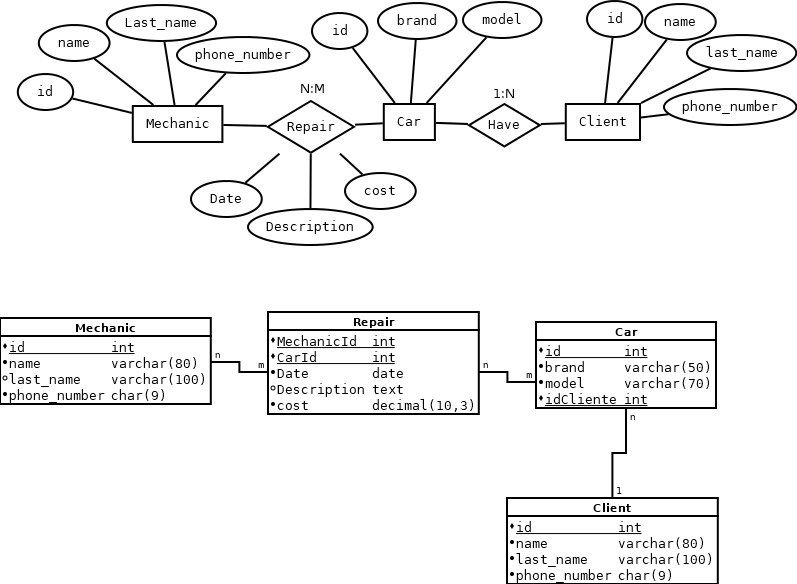

#Workshop Management Service

My initial idea is to build a fully functional, console-based application—drawing on my knowledge of databases and how to handle them using Java—that would allow a repair shop to manage its database much more easily. 

The person using the application will be able to easily add mechanics, customers, and appointments, as well as search for any type of information in the database.

##Phase 1: DataBase design

